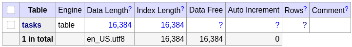
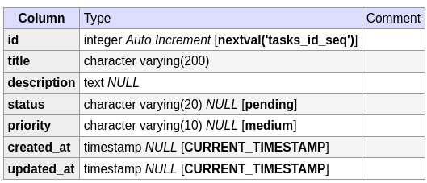
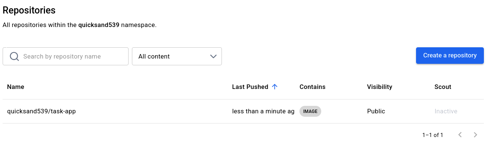
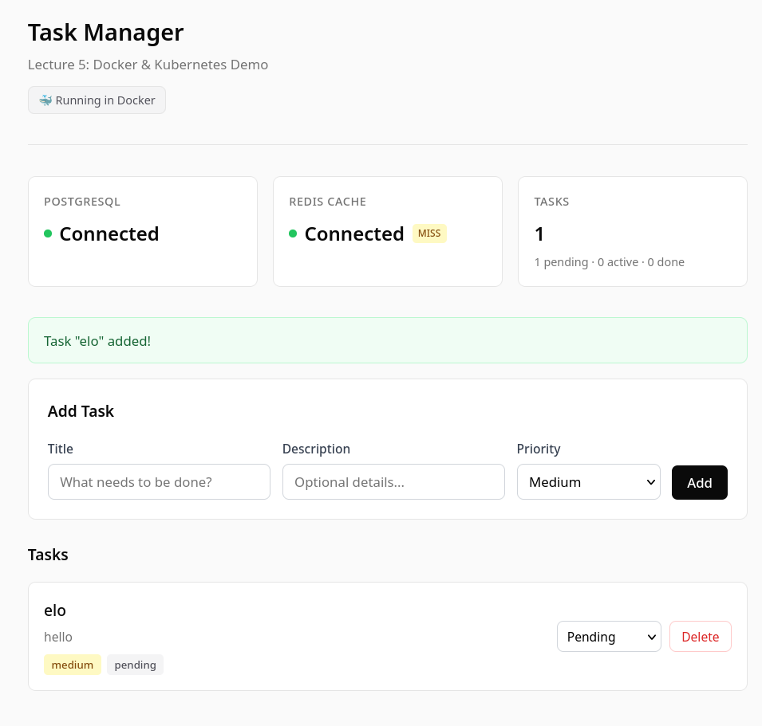
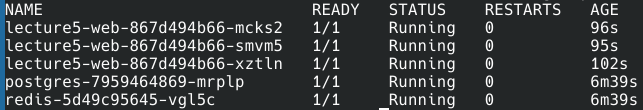
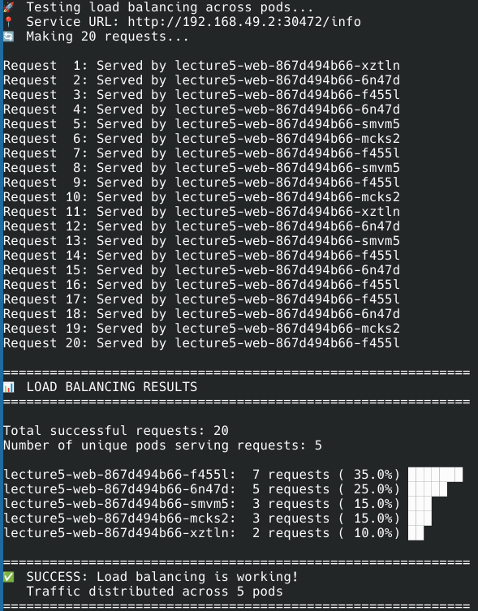
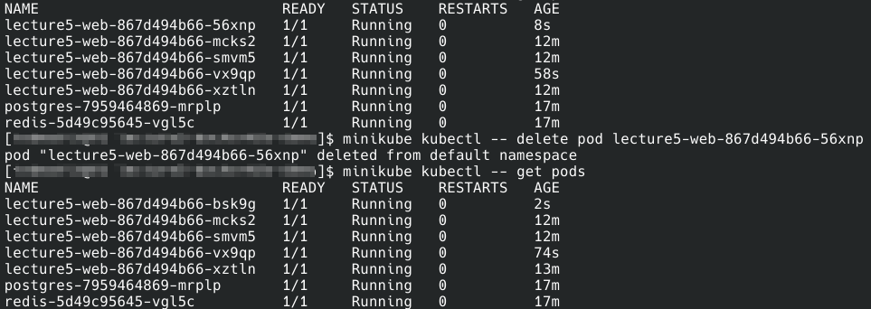

# Lecture Five Exercise

Link to the fork on GitHub:\
https://github.com/tedmatik/lecture5-dockerk8s-demo
Docker Hub username:\
Quicksand539

## Task One

\

The alpine version uses 80 instead of 180 MB of space \
No build issues, just change the dockerfile and build

## Task Two

Commands used:\
docker login\
tag app with username\
docker push\

What the commands show:\
docker compose logs gives the logs, everything that happened (like when adding/deleting a task what happens in the back end)\
Docker inspect gives some info about the container like settings, ports, configurations etc., pretty detailed stuff\
Docker stats shows all running containers and some stats, like memory and cpu usage, pid etc.\

## Task Three

\

The load is managed by services
Kubernetes distributes traffic via services, which have a config stored in the etcd. The controller then assigns an IP and a new pod may be started by the scheduler (if needed). Externally, we talk to the pods via the services and not directly to the pods (as their IP address might be changing). Kubernetes can also autoscale with respect to e.g. cpu or memory usage and spawn new pods (through the horizontal pod autoscaler for example).

I am not fast enough for a screenshot during deletion\
\
One docker is really new, created directly after deletion\
Self healing is important because some pods might go down because of hardware, usage, bugs or other reasons. In this case, it is important to spawn a new one, otherwise they might fall off one by one and at some point we are left with none at all.